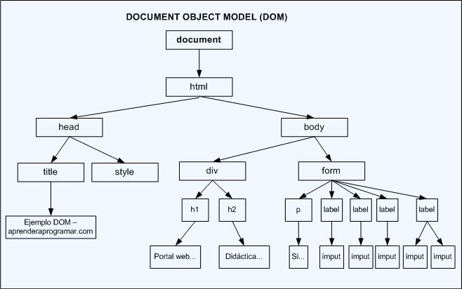
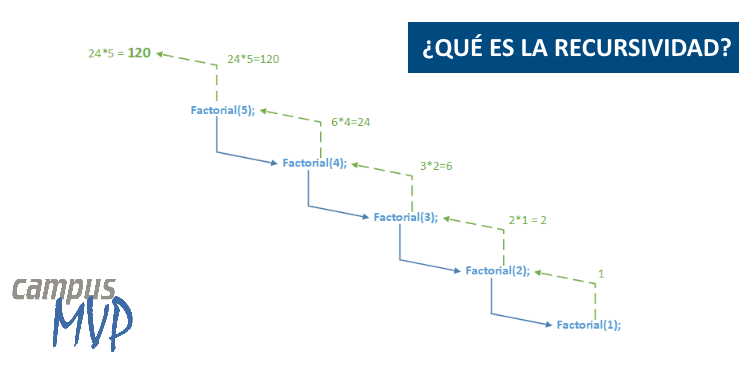

## Use strict

`"use strict"`; Define que el código JavaScript debe ejecutarse en "modo estricto".
Con el modo estricto, no puede, por ejemplo, usar variables no declaradas.

# Desestructuración

[Desestructuración](https://developer.mozilla.org/es/docs/Web/JavaScript/Reference/Operators/Destructuring_assignment)

La sintaxis de desestructuración es una expresión de JavaScript que permite desempacar valores de arreglos o propiedades 
de objetos en distintas variables.

	const x = [1, 2, 3, 4, 5];
	const [y, z] = x;
	console.log(y); // 1
	console.log(z); // 2

### Asignación separada de la declaración

	let a, b;
	[a, b] = [1, 2];
	console.log(a); // 1
	console.log(b); // 2
	
### Valores predeterminados

	let a, b;
	[a=5, b=7] = [1];
	console.log(a); // 1
	console.log(b); // 7

### Intercambio de variables

	let a = 1;
	let b = 3;

	[a, b] = [b, a];
	console.log(a); // 3
	console.log(b); // 1

	const arr = [1,2,3];
	[arr[2], arr[1]] = [arr[1], arr[2]];
	console.log(arr); // [1,3,2]

### Analizar un arreglo devuelto por una función

	function f() {
	  return [1, 2];
	}

	let a, b;
	[a, b] = f();
	console.log(a); // 1
	console.log(b); // 2

### Ignorar algunos valores devueltos

	function f() {
	  return [1, 2, 3];
	}

	const [a, , b] = f();
	console.log(a); // 1
	console.log(b); // 3

	const [c] = f();
	console.log(c); // 1

También puedes ignorar todos los valores devueltos:

	[,,] = f();

### Asignar el resto de un arreglo a una variable

	const [a, ...b] = [1, 2, 3];
	console.log(a); // 1
	console.log(b); // [2, 3]

### Desestructuración de objetos

#### Asignación básica

	const user = {
	    id: 42,
	    is_verified: true
	};

	const {id, is_verified} = user;

	console.log(id); // 42
	console.log(is_verified); // true

Los paréntesis (...) alrededor de la declaración de asignación son obligatorios cuando se usa la desestructuración de un
objeto literal sin una declaración.

{a, b} = {a: 1, b: 2} no es una sintaxis independiente válida, debido a que {a, b} en el lado izquierdo se considera un
bloque y no un objeto literal.

#### Asignación sin declaración

A una variable se le puede asignar su valor con desestructuración separada de su declaración.

	let a, b;

	({a, b} = {a: 1, b: 2});


#### Asignar a nuevos nombres de variable

Una propiedad se puede desempacar de un objeto y asignar a una variable con un nombre diferente al de la propiedad del objeto.

	const o = {p: 42, q: true};
	const {p: foo, q: bar} = o;

	console.log(foo); // 42
	console.log(bar); // true
	
#### Valores predeterminados

A una variable se le puede asignar un valor predeterminado, en el caso de que el valor desempacado del objeto sea undefined.

	const {a = 10, b = 5} = {a: 3};

	console.log(a); // 3
	console.log(b); // 5

#### Asignar nombres a nuevas variables y proporcionar valores predeterminados

Una propiedad puede ser ambas

    Desempacada de un objeto y asignada a una variable con un nombre diferente.
    Se le asigna un valor predeterminado en caso de que el valor desempacado sea undefined.

	const {a: aa = 10, b: bb = 5} = {a: 3};

	console.log(aa); // 3
	console.log(bb); // 5

#### Desempacar campos de objetos pasados como parámetro de función

	const user = {
	  id: 42,
	  displayName: 'jdoe',
	  fullName: {
	    firstName: 'John',
	    lastName: 'Doe'
	  }
	};

	function userId({id}) {
	  return id;
	}

	function whois({displayName, fullName: {firstName: name}}) {
	  return `${displayName} es ${name}`;
	}

	console.log(userId(user)); // 42
	console.log(whois(user));  // "jdoe es John"

Esto desempaca el id, displayName y firstName del objeto user y los imprime.

#### Establecer el valor predeterminado de un parámetro de función

	function drawChart({size = 'big', coords = {x: 0, y: 0}, radius = 25} = {}) {
	  console.log(size, coords, radius);
	  // haz un dibujo de gráfico
	}

	drawChart({
	  coords: {x: 18, y: 30},
	  radius: 30
	});


# Notas importantes

### window.onload
Como el código Javascript es ejecutado antes de que la etiqueta body HTML sea cargada, document.body es null.
Ejecutar el código dentro de la función window.load soluciona este problema.

	window.onload = function() {

	};
	
Ejemplo:

      window.onload = () => {
      
        const p = document.createElement('p');
	
        p.innerHTML = 'Lorem ipsum';
	
        document.body.appendChild(p);
      };

### addEventListener() y pasar parámetros

Soluciona el problema de que la función se ejecute sin llamarla.

      element.addEventListener("click", function(){ myFunction(p1, p2); });

[Mirar: Pasar parámetros](https://www.w3schools.com/js/js_htmldom_eventlistener.asp)
[Ejemplo](https://es.stackoverflow.com/questions/345390/porque-sucede-esto-no-entiendo-addeventlistenerclick-se-ejecuta-auto)
[Ejemplo2](https://es.stackoverflow.com/questions/301517/la-funcion-en-onclick-se-ejecuta-sin-hacer-click)

# Clases


[Clases](https://developer.mozilla.org/es/docs/Web/JavaScript/Reference/Classes)

Las clases de javascript son una mejora sintáctica sobre la herencia basada en prototipos de JavaScript. La sintaxis de
las clases no introduce un nuevo modelo de herencia orientada a objetos en JavaScript. Las clases de JavaScript proveen 
una sintaxis mucho más clara y simple para crear objetos y lidiar con la herencia.

9.2 Clases vs. Prototipos

Los lenguajes orientados a objetos basados en clases como Java o C++, se basan en el concepto de dos entidades distintas: la clase y las instancias. Un lenguaje basado en prototipos, como JavaScript, no hace esta distinción: simplemente maneja
objetos. Este tipo de lenguajes tiene la noción de objetos prototipo, objetos usados como platilla para obtener las 
propiedades iniciales de un objeto. Cualquier objeto puede especificar su propias propieades, tanto en el momento que los
creamos como en tiempo de ejecución. Además, cualquier objeto puede asociarse como prototipo a otro objeto, permitiendo 
compartir todas sus propiedades.

En Javascript:

- Todos los objetos son instancias
- Las clases se definen y crean con las funciones constructoras.
- Un objeto se instancia con el operador new.
- La estructura de clases se crea asignando un objeto como prototipo.
- La herencia de propiedades se realiza a través de la cadena de prototipos.
- La función constructora o el prototipo especifican unas propiedades iniciales. Se pueden añadir o eliminar estas
propiedades en tiempo de ejecución, en un objeto concreto o a un conjunto de objetos.

### Declaración de clases

	class Rectangulo {
	  constructor(alto, ancho) {
	    this.alto = alto;
	    this.ancho = ancho;
	  }
	}

### Alojamiento

Una importante diferencia entre las declaraciones de funciones y las declaraciones de clases es que las declaraciones de funciones son alojadas y las declaraciones de clases no lo son. En primer lugar necesitas declarar tu clase y luego acceder a ella, de otro modo el ejemplo de código siguiente arrojará un ReferenceError:

	const p = new Rectangle(); // ReferenceError

	class Rectangle {}
### Expresiones de clases

Una expresión de clase es otra manera de definir una clase. Las expresiones de clase pueden ser nombradas o anónimas. El nombre dado a la expresión de clase nombrada es local dentro del cuerpo de la misma.

	// Anonima
	let Rectangulo = class {
	  constructor(alto, ancho) {
	    this.alto = alto;
	    this.ancho = ancho;
	  }
	};

	console.log(Rectangulo.name);
	// output: "Rectangulo"

	// Nombrada
	let Rectangulo = class Rectangulo2 {
	  constructor(alto, ancho) {
	    this.alto = alto;
	    this.ancho = ancho;
	  }
	};
	console.log(Rectangulo.name);
	// output: "Rectangulo2"

### Constructor

El método constructor es un método especial para crear e inicializar un objeto creado con una clase. Solo puede haber un
método especial con el nombre "constructor" en una clase. Si esta contiene mas de una ocurrencia del método constructor,
se arrojará un Error SyntaxError

Un constructor puede usar la palabra reservada super para llamar al constructor de una superclase.

### Métodos prototipo

Vea también métodos definidos.

	class Rectangulo {
	  constructor (alto, ancho) {
	    this.alto = alto;
	    this.ancho = ancho;
	  }
	  // Getter
	  get area() {
	     return this.calcArea();
	   }
	  // Método
	  calcArea () {
	    return this.alto * this.ancho;
	  }
	}

	const cuadrado = new Rectangulo(10, 10);

	console.log(cuadrado.area); // 100

### Métodos estáticos

La palabra clave static define un método estático para una clase. Los métodos estáticos son llamados sin instanciar su
clase y no pueden ser llamados mediante una instancia de clase. Los métodos estáticos son a menudo usados para crear
funciones de utilidad para una aplicación.

	class Punto {
	  constructor ( x , y ){
	    this.x = x;
	    this.y = y;
	  }

	  static distancia ( a , b) {
	    const dx = a.x - b.x;
	    const dy = a.y - b.y;

	    return Math.sqrt ( dx * dx + dy * dy );
	  }
	}

	const p1 = new Punto(5, 5);
	const p2 = new Punto(10, 10);

	console.log (Punto.distancia(p1, p2)); // 7.0710678118654755

### Subclases con extends

La palabra clave extends es usada en declaraciones de clase o expresiones de clase para crear una clase hija.

	class Animal {
	  constructor(nombre) {
	    this.nombre = nombre;
	  }

	  hablar() {
	    console.log(this.nombre + ' hace un ruido.');
	  }
	}

	class Perro extends Animal {
	  hablar() {
	    console.log(this.nombre + ' ladra.');
	  }
	}

Fijarse que las clases no pueden extender objectos regulares (literales). Si se quiere heredar de un objecto regular, se debe user Object.setPrototypeOf()::

	var Animal = {
	  hablar() {
	    console.log(this.nombre + ' hace ruido.');
	  },
	  comer() {
	    console.log(this.nombre + ' se alimenta.');
	  }
	};

	class Perro {
	  constructor(nombre) {
	    this.nombre = nombre;
	  }
	  hablar() {
	    console.log(this.nombre + ' ladra.');
	  }
	}

	// Solo adjunta los métodos aún no definidos
	Object.setPrototypeOf(Perro.prototype, Animal);

	var d = new Perro('Mitzie');
	d.hablar(); // Mitzie ladra.
	d.comer(); // Mitzie se alimenta.

### Llamadas a súperclases con super

La palabra clave super es usada para llamar funciones del objeto padre.

	class Gato {
	  constructor(nombre) {
	    this.nombre = nombre;
	  }

	  hablar() {
	    console.log(this.nombre + ' hace ruido.');
	  }
	}

	class Leon extends Gato {
	  hablar() {
	    super.hablar();
	    console.log(this.nombre + ' maulla.');
	  }
	}


### Propiedades privadas
	class ClassWithPrivateField {
	  #privateField
	}

	class ClassWithPrivateMethod {
	  #privateMethod() {
	    return 'hello world'
	  }
	}

	class ClassWithPrivateStaticField {
	  static #PRIVATE_STATIC_FIELD
	}


# Objetos

[Objetos](https://developer.mozilla.org/es/docs/Web/JavaScript/Guide/Working_with_Objects#herencia)

## Creación de nuevos objetos

Opciones: iniciadores de objeto, función constructora y Object.create

### Uso de iniciadores de objeto

El uso de iniciadores de objetos a veces se denomina crear objetos con notación literal.

	var obj = { property_1:   value_1,   // property_# puede ser un identificador...
		    2:            value_2,   // o un número...
		    // ...,
		    'property n': value_n }; // o una cadena

Los objetos se crean como si se hiciera una llamada a new Object(); es decir, los objetos hechos a partir de expresiones
literales de objeto son instancias de Object.

También puedes utilizar iniciadores de objetos para crear arreglos. Consulta arreglos literales.

### Usar una función constructora

Pasos:

1. Definir el tipo de objeto escribiendo una función constructora. Existe una fuerte convención, con buena razón, para utilizar en mayúscula la letra inicial.

		function Car(make, model, year) {
		  this.make = make;
		  this.model = model;
		  this.year = year;
		}

2. Crear una instancia del objeto con el operador new.

		var mycar = new Car('Eagle', 'Talon TSi', 1993);

Puedes crear cualquier número de objetos Car con las llamadas a new. Por ejemplo,

	var kenscar = new Car('Nissan', '300ZX', 1992);
	var vpgscar = new Car('Mazda', 'Miata', 1990);

### Usar el método Object.create

Te permite elegir el prototipo del objeto que deseas crear, sin tener que definir una función constructora.

	var Animal = {
	  type: 'Invertebrates', // Valor predeterminado de las propiedades
	  displayType: function() {  // Método que mostrará el tipo de Animal
	    console.log(this.type);
	  }
	};

	// Crea un nuevo tipo de animal llamado animal1
	var animal1 = Object.create(Animal);
	
	var fish = Object.create(Animal);
	fish.type = 'Fishes';

## Definición de las propiedades de un tipo de objeto

Puedes agregar una propiedad a un tipo de objeto definido previamente mediante el uso de la propiedad prototype. Esto define una propiedad que es compartida por todos los objetos del tipo especificado, en lugar de por una sola instancia del objeto. El siguiente código agrega una propiedad color a todos los objetos del tipo Car, y luego asigna un valor a la propiedad color del objeto car1.

	Car.prototype.color = null;
	car1.color = 'black';
	
## Definición de métodos

	objectName.methodname = functionName;
	
	// O ESTO 
	
	var myObj = {

	  myMethod: function(params) {

	    // ...hacer algo
	  }

	  // O ESTO TAMBIÉN FUNCIONA

	  myOtherMethod(params) {

	    // ...hacer algo más
	  }
	};

`this`: En nuestra función nos referimos al Objeto con `this`.

Entonces puedes llamar al método en el contexto del objeto de la siguiente manera:

	object.methodname(params);

### Definir métodos dentro de la función constructora

	function displayCar() {
	  var result = `Un hermoso ${this.year} ${this.make} ${this.model}`;
	  pretty_print(result);
	}
	
	function Car(make, model, year, owner) {
	  this.make = make;
	  this.model = model;
	  this.year = year;
	  this.owner = owner;
	  this.displayCar = displayCar;
	}

## Definición de captadores (getters) y establecedores (setters)

1. Usando iniciadores de objeto:

		var objeto = {
		  a: 7,
		  get getB() {
		    return this.a + 1;
		  },
		  set setA(x) {
		    this.a = x / 2;
		  }
		}; 

		console.log (objeto.a); // 7
		console.log (objeto.getB); // 8 <-- En este punto se inicia el método get b().
		objeto.setA = 50;         // <-- En este punto se inicia el método set c(x)
		console.log(objeto.a); // 25

2. Usando el método Object.defineProperties:

Si más tarde necesitas agregar captadores y establecedores — porque no lo escribiste en el objeto prototipo o particular — entonces la segunda forma es la única forma posible.

El primer parámetro de este método es el objeto sobre el que se quiere definir el captador o establecedor.

	var o = { a: 0 };

	Object.defineProperties(o, {
	    'b': { get: function() { return this.a + 1; } },
	    'c': { set: function(x) { this.a = x / 2; } }
	});

	o.c = 10; // Ejecuta el establecedor, que asigna 10/2 (5) a la propiedad 'a'
	console.log(o.b); // Ejecuta el captador, que produce un + 1 o 6


## Unir objetos 

### Con spread operator

	const marcas1 = {'a': 'Fiat', 'b': 'Seat'};
	const marcas2 = {'c': 'Renault'};
	const marcas3 = {'d': 'Ford'};
	const marcasFinal = {...marcas1, ...marcas1, ...marcas1};

### Con assign

	var o1 = { a: 1 };
	var o2 = { b: 2 };
	var o3 = { c: 3 };

	var obj = Object.assign(o1, o2, o3);
	console.log(obj); // { a: 1, b: 2, c: 3 }
	console.log(o1);  // { a: 1, b: 2, c: 3 }, target object itself is changed.


`var myObject = new Object()`

`myObject.property1 = value1`

`myObject.property2 = value2`

`myObject.property = value`  -> para modificar valores o añadir propiedades

`myObject[property] = value` -> necesario para propiedades con espacios o propiedades contenidas en variables

`delete object.property` -> borrar propiedad

`obj.hasOwnProperty(propiedad)`  -> Determinar si un obj tiene cierta propiedad
	
array = [{(obj)}, {(obj)}]

## Herencia

[Herencia](https://developer.mozilla.org/es/docs/Web/JavaScript/Inheritance_and_the_prototype_chain)

En lo que a herencia se refiere, JavaScript sólo tiene una estructura: objetos. 
Cada objeto tiene una propiedad privada (referida como su [[Prototype]]) que mantiene un enlace a otro objeto llamado su prototipo. Ese objeto prototipo tiene su propio prototipo, y así sucesivamente hasta que se alcanza un objeto cuyo prototipo es null.
Por definición, null no tiene prototipo, y actúa como el enlace final de esta cadena de prototipos.
Casi todos los objetos en JavaScript son instancias de Object que se sitúa a la cabeza de la cadena de prototipos.

#### Heredando propiedades

### SUBPROPIEDADES

	const myObject = {

	  propiedad: {

	    subpropiedad: valor

	  },
	  propiedad: {

	    subpropiedad: { 

	      subpropiedad: valor,

	      subpropiedad: valor

	    },

	    subpropiedad: valor

	  }

	};
		
`obj.propiedad.subpropiedad`

## NESTED ARRAYS

	const ourPets = [
	
	  {
	  
	    animalType: "cat",
	    
	    names: [
	    
	      "Meowzer",
	      
	      "Fluffy",
	      
	      "Kit-Cat"
	      
	    ]
	    
	  },
	  
	  {
	    animalType: "dog",
	    
	    names: [
	    
	      "Spot",
	      
	      "Bowser",
	      
	      "Frankie"
	      
	    ]
	    
	  }
	  
	];
	
	ourPets[0].names[1]

## Object.method

### Object.isFrozen()

El método `Object.isFrozen(obj)` determina si un objeto está congelado.

Un objeto está congelado si y solo si no es extendible, todas sus propiedades son no-configurables, y todos los datos de sus propiedades no tienen capacidad de escritura.

### Object.seal()

El método `Object.seal(obj)` sella un objeto, previniendo que puedan añadirse nuevas propiedades al mismo, y marcando todas
las propiedades existentes como no-configurables. Los valores de las propiedades presentes permanecen pudiendo cambiarse en
tanto en cuanto dichas propiedades sean de escritura.

`Object.isSealed(obj)`

### Object.keys

### Object.values

### Object.entries

# Comillas invertidas \`\`**

      Ejemplo: const userInfo = `User info: ${name} ${surname} ${telephone}`;


# Instalar Node.js

    Node.js es un entorno en tiempo de ejecución multiplataforma, de código abierto, para la capa del servidor
    
    basado en el lenguaje de programación JavaScript, asíncrono, con E/S de datos en una arquitectura orientada 
    
    a eventos y basado en el motor V8 de Google.
    
# NPM

En la terminal de un proyecto:

`npm init`

`npm install eslint --save dev`

Opción Standard:

    npm install standard -D
    
    En package.json:
    
    "eslintConfig": {
    "extends": "./node_modules/standard/eslintrc.json"
  }

Personalizar reglas:

    parserOptions: {
        eslint: 'recommended',
    }
    rules:{
        quotes: ['error', 'double'],
    }
    
    package.json:
        crear nuevo script
        "scripts": {
            "test": "echo \"Error: no test spectified\" && exit 1",
            "link": "npx eslint . --ext .js"
            "link-fix": "npx eslint . --ext .js --fix"

# Instalar Extensión Eslint

Extensión Live Server de Ritwick Dey para actualizar la página html automáticamente.

Una vez instalada, podemos pulsar el botón de abajo a la derecha que pone "Go live" para correr un Live server

**Extensión JavaScript (ES6) code snippets de charalampos karypidis**


Devuelve un número entre max y min, incluyéndolos

# DOM

Document object mode

    Interfaz de programación para los documentos HTML y XML.

Facilita una representación estructurada del documento y define de qué manera los programas pueden acceder, al fin de modificar, tanto su estructura, estilo y contenido. El DOM da una representación del documento como un grupo de nodos y objetos estructurados que tienen propiedades y métodos. Esencialmente, conecta las páginas web a scripts o lenguajes de programación.

`Una página web es un documento`. Éste documento puede exhibirse en la ventana de un navegador o también como código fuente HTML. Pero, en los dos casos, es el `mismo documento`. El `modelo de objeto de documento (DOM)` proporciona otras `formas de presentar, guardar y manipular` este mismo documento. El DOM es una `representación completamente orientada al objeto de la página web` y puede ser `modificado con un lenguaje de script` como JavaScript.



Ejemplos:

Por ejemplo, el DOM de W3C especifica que el método getElementsByTagName en el código de abajo debe devolver una lista de todos los elementos \<p> del documento:

    paragraphs = document.getElementsByTagName ("p");
    // paragraphs[0] es el primer elemento <p>
    // paragraphs[1] es el segundo elemento <p>, etc.
    alert (paragraphs [0].nodeName);


# BOM
        
Browser Object Model
        
El `window` objeto es compatible con todos los navegadores. Representa la ventana del navegador.


        
`window.localStorage`
        
La propiedad de sólo lectura localStorage te permite acceder al objeto local Storage; los datos persisten almacenados entre de las diferentes sesiones de navegación.

window.localStorage.getItem()
        
# Recursión

Recursión es cuando una función sigue llamándose a sí misma, hasta que ya no tiene que hacerlo.

Piensa en recursión como una carrera en un circuito. Es como correr la misma pista una y otra vez, pero las vueltas se hacen más pequeñas cada vez. Eventualmente, correrás la vuelta más pequeña y se terminará la carrera.

Lo mismo con la recursión: La función sigue llamándose a sí misma, cada vez con una entrada menor hasta que eventualmente se detiene.

Pero, la función no decide por sí misma cuando parar. Nosotros le decimos cuando. Nosotros le damos a la función una condición conocida como `caso base`.

      Se llama recursividad a un proceso mediante el que una función se llama a sí misma de forma repetida, hasta que se
      satisface alguna determinada condición. El proceso se utiliza para computaciones repetidas en las que cada acción 
      se determina mediante un resultado anterior. Se pueden escribir de esta forma muchos problemas iterativos.
      
### Ejemplos de recursión

1. Cuenta regresiva desde un número dado hasta el número más pequeño, restando 1 cada vez que pasa por el bucle.

Dado el número 5, la salida será:

    // 5
    // 4
    // 3
    // 2
    // 1
    
Esta función con recursión será:

    function cuentaAtras (numero) {
        if (numero === 0) {
            return; // si es 0 no devuelve ningún valor
        }
        console.log(numero);
        return cuentaAtras(numero - 1);
    };

Esto es lo que sucede:

    1// La entrada actual es 5
    2// Es 5 igual a 0 ?
    3// No, entonces imprime 5 en la consola.
    4// Se llama asi misma de nuevo con el numero - 1 O 5 - 1;
    5// La entrada principal es 4
    6// Es 4 igual a 0 ?
    7// No, entonces imprime 4 en la consola.
    8// Repite hasta que la entrada sea 0, y asi la función deja de llamarse a si misma cuando lleg al caso base (numero === 0).
    
    function cuentaAtras (3) {
        if (numero === 0) {
            return; 
        }
        console.log(3);
        return cuentaAtras(3 - 1);
                  cuentaAtras (2) {
                    if (numero === 0) {
                        return; 
                    }
                    console.log(2);
                    return cuentaAtras(2 - 1);
                              cuentaAtras (1) {
                                if (numero === 0) {
                                    return; 
                                }
                                console.log(1);
                                return cuentaAtras(1 - 1);
                                          cuentaAtras (0) {
                                            if (numero === 0) {
                                                return; 
                                            }
                         //no se ejecuta    console.log(1);
                         //no se ejecuta    return cuentaAtras(1 - 1);
    };
    

2. Cuenta regresiva desde un número dado hasta el número más pequeño, restando 1 cada vez que pasa por el bucle, pero devolviendo un array.


Dado el número 5, la salida será:

    // [1, 2, 3, 4, 5]

Esta función con recursión será:

    function countup(n) {
      if (n < 1) {
        return [];
      } else {
        const countArray = countup(n - 1);
        countArray.push(n);
        return countArray;
      }
    }
    console.log(countup(5));


Esto es lo que sucede:

    1// La entrada actual es 5
    2// Es 5 menor que 1 ?
    3// No, entonces: c
        const countArray = countup(5-1)
        count.Array.push(5)
        
    4// Se llama asi misma de nuevo con el numero - 1 O 5 - 1;
    5// La entrada principal es 4
    6// Es 4 igual a 0 ?
    7// No, entonces imprime 4 en la consola.
    8// Repite hasta que la entrada sea 0, y asi la función deja de llamarse a si misma cuando lleg al caso base (numero === 0).

```
function countup(5) {
      if (5 < 1) {
        return [];
      } else {
        const countArray = countup(5 - 1);
                function countup(4) {
                      if (4 < 1) {
                            return [];}
                      else {
                            const countArray = countup(4 - 1);
                                    function countup(3) {
                                          if (3 < 1) {
                                            return [];
                                          } 
                                          else {
                                            const countArray = countup(3 - 1);
                                                    function countup(2) {
                                                          if (2 < 1) {
                                                            return [];
                                                          } 
                                                          else {
                                                            const countArray = countup(2 - 1);
                                                                    function countup(1) {
                                                                          if (1 < 1) {
                                                                            return [];
                                                                          } 
                                                                          else {
                                                                            const countArray = countup(1 - 1);
                                                                            function countup(0) {
                                                                                  if (0 < 1) {
                                                                            #1         return [];
                                                                                  } 
                                                                                  else {
                                                                                    const countArray = countup(0 - 1);

                                                                                    countArray.push(0);
                                                                                    return countArray;
                                                                                  }
                                                                             }
                                                                    #2      countArray.push(1);
                                                                    #3      return countArray;
                                                                          }
                                                                     }
                                                      4#     countArray.push(2);
                                                      5#     return countArray;
                                                          }
                                                     }
                                      5#    countArray.push(3);
                                      6#    return countArray;
                                          }
                                     }
                        7#   countArray.push(4);
                        8#   return countArray;
                      }
                }
   9#   countArray.push(5);
   10#  return countArray;
      }
}

```


3. Función factorial.

Dado el número 5, la salida será:
    
    // 120
    
Esta función con recursión será:

    function factorial(n) {
        if (n<=1) return 1; 
        return n* factorial(n-1);
    }


Esto es lo que sucede:

    1// La entrada actual es 5
    2// Es 5 menor o igual a 1 ?
    3// No, Ok entonces devuelve 5 * factorial(5-1);
    4// Se llama asi misma de nuevo con el numero - 1 ó 5 - 1;
    5// La entrada principal es 4
    6// Es 4 menor o igual a 1 ?
    7// No, Ok entonces devuelve 4 * factorial(4-1);
    8// Se llama asi misma de nuevo con el numero - 1 ó 4 - 1;
    5// La entrada principal es 3
    6// Es 3 menor o igual a 1 ?
    7// No, Ok entonces devuelve 3 * factorial(3-1);
    // Ya tenemos 5 * 4 * 3 * ..
    8// Repite hasta que la entrada sea 0, y asi la función deja de llamarse a si misma cuando llega al caso base (numero === 0).
    // Devuelve 5 * 4 * 3 * 2 * 1




# Expresiones Regulares    RegExp

## Web

[regex101.com](https://regex101.com/)

### Instanciación

Normalmente  son una constante:

    const expReg = / ___ /
    const expReg = RegExp (" ___ ")
    
## Búsqueda de coincidencias

El método `exec()` ejecuta una busqueda sobre las coincidencias de una expresión regular en una cadena especifica. 

Devuelve el resultado como **array**, o **null**.

    expReg.exec(cadena)
    
El método `test()` ejecuta la búsqueda de una ocurrencia entre una expresión regular y una cadena especificada. 

Devuelve `true` o `false`.

    regexObj.test(cadena)

El método find

    arr.find(elem => {return elem.length <= 3})

El método filter

    arr.filter (elem => elem.length <= 3)

## Mensaje de error

El método `console.assert()` escribe un mensaje de error si la  assertion es `false`. Si la aserción es `true`, nada ocurre. 

## Aserciones

`^` Coincide con el comienzo de la entrada.

`$` Coincide con el final de la entrada.

## Clases de caracteres

`\w  `  Equivale a [A-Za-z0-9_] Busca cualquier caracter alfanumérico del alfabeto latino básico,

`\W  `  Equivale a [^A-Za-z0-9_]    Busca cualquier caracter que no sea un caracter de palabra del alfabeto latino básico. Coincide con %,&, $ ...

`\d`    Equivale a [0-9] 

`\d`    Equivale a [^0-9]   Busca cualquier caracter que no sea un dígito

`\s`    Espacio en blanco

`\n`    Salto de línea

`.`     Cualquier caracter

## Cuantificadores

`x{n}` Donde "n" es un número entero positivo, concuerda exactamente con "n" apariciones del elemento "x" anterior.

`x{n,m}` Coincide con al menos "n" y como máximo "m" apariciones del elemento "x" anterior.

`?` 0 ó 1 Se detendrá tan pronto como encuentre una coincidencia

`*` 0 ó más

`+` Uno o más

## Ejemplos

`^(\d{3}\s){2}\d{3}$`  Coincide con  123-456-789

`^(\d{3}(\s|-|\/)){2}\d{3}$`  Coincide con  123-456-789 , 123/456/789 ó 123 456 789

`/a+e*i?/`  Coincide con a, ae , aei, aaei, aaeei, ...

`^\d{8}(-|\s)?[a-zA-Z]$`    Coincide con 54733151M, 54733151 m, 54733151-M

    ^\d{8} Comienza con 8 dígitos
    
    (-|\s)? Lleva 0 ó 1 de '-' ó ' '
    
    [a-zA-Z]$   Termina con una letra minúscula o mayúscula

const comprobarRegExp = () => {

    /*

    Comprobación de un email

    */

    \/\/1ºDeclaramos la expReg

    const expReg = RegExp("")


# Porquería de freecodecamp

Javascript
Enlazar a html	<script src="./script.js"></script>

Comentarios
	//Una línea
	/*Varias
	líneas*/
var nombreVariable ;
var nombreVariable = "nombre";
nombreVariable = "otro";
varible = otraVariable;
camelCase
Las variables locales tienen preferencia sobre las globales

let 	puede modificarse 
no puede volver a declararse
tienen un ámbito de bloque

let saludar = "dice Hola";
saludar = "dice Hola tambien";

let saludar = "dice Hola";
let saludar = "dice Hola tambien"; // error

let saludar = "dice Hola";
if (true) {
      let saludar = "dice Hola tambien";
console.log(saludar); // "dice Hola tambien"
}
console.log(saludar); // "dice Hola"
	
const	no puede modificarse ni volver a declararse
	tienen un ámbito de bloque
	EN MAYÚSCULAS

++	i++; = i = i + 1;
--
+=
-=
/=
*=

" \" \" "	"I am a \"double quoted\" string inside \"double quotes\"."
" " = ' '
\'	single quote
\"	double quote
\\	backslash
\n	newline
\r	carriage return
\t	tab
\b	word boundary
\f	form feed

"" + ""	Concadenar
	'My name is Alan,' + ' I concatenate.'
	+=
STRING
	String.length
	String[n] Bracket notation
		->Caracter en la posicion n
		Empieza en 0
		Última posición =  Str.length - 1
	String values are immutable
	String.split()	-> lo convierte en un array
	String.trim()	-> Quita los espacios de los extremos
	
parseInt(string) -> lo convierte a Int
      parseInt(string, 2) -> String de un número binario
\`   \`   Para concatenar

ARRAY
array = [ , , [ ] ]
array[index] 
      el index empieza por 0
      no separar [] del array -> array[][]
.push()	Añade elementos al final del array
.unshift() Añade elementos al inicio del array
.pop()	Elimina el elemento final del array, puede devolverlo a una variable
.shift() Elimina el elemento primero del array, puede devolverlo a una variable
array.splice()
arr.fill() Rellenar el array
arr.join (separador)	-> Une los elementos de un array
arr.reverse()
		
new Array (n)  Array con n posiciones
new Array (a,b,c)  ==  [a,b,c]
arr2 = [...arr] Copiar array en otro
arr2 = [].concant(arr2) Copiar array
	
FUCTION
	function nombre(parámetros){
	puede modificar el valor de una variable global
	return
BOOLEAN
	true/false
	return (expresión con operadores booleanos) -> devuelve boolean
CONDITIONAL
	if (){
	else if (){
	else {


OPERADOR CONDICIONAL -> expresion ? valor1(en caso de true) : valor2 (en caso de false)

Multiple Conditional (Ternary) Operators a? b : c? d : e


==	No importa el tipo de valor '3'== 3
=== 	Sí importa el tipo de valor '3'!= 3
!=	Difieren en valor
!==	Difieren en valor y tipo
>	No importa el tipo
>= 	""
<  <=
&	and, sin paréntesis
      a &= b 	Es equivalente a a = a & b
|	or
      a |= b 	Es equivalente a a = a | b
^	xor
      a ^= b
~ not


a << b  LEFT SHIFT 	Desplazamiento de bits hacia la izquierda. Ej: 11 (3) pasa a 110 (6).
a >> b RIGHT SHIFT  	Desplazamiento de bits hacia la derecha. Ej: 11 (3) pasa a 1 (1).
		
TIPEOF <valor>	Devuelve el tipo de valor (number. boolean...)

SWITCH
	switch (lowercaseLetter) {
	  case "a":
	    console.log("A");
	    break;
	  case "b":
	    console.log("B");
	    break;
	  default:
	    defaultStatement;
	    break;
	}
	(===)
	Se ejecutan los cases hasta que haya un break
		case 1:
	    	case 2:
	    	case 3:
	     	 answer = 'A';
	      	 break;
	
	switch (true){
		case expresión booleana
		
		
console.log()	Útil para debugguear, mostrar los resultados correctos
	(typeof())
console.clear()

Rango de index correcto de un string o array =>  (let i = 0; i < len; i++)

.forEach


eval()

OBJECT
	const cat = {
	  "name": "Whiskers",
	  "legs": 4,
	  "tails": 1,
	  "enemies": ["Water", "Dogs"]
	};
	
	object.property
	object[property] -> necesario para propiedades con espacios
	object[variable_con_el_nombre_de_la_propiedad]
	
	object.property = valor     ->		para modificar valores o añadir propiedades
	object[property] = valor
	
	delete object.property

	obj.hasOwnProperty(propiedad)  -> Determinar si un obj tiene cierta propiedad
	array = [{(obj)}, {(obj)}]
	
	SUBPROPIEDADES
		const ourStorage = {
		  "desk": {
		    "drawer": "stapler"
		  },
		  "cabinet": {
		    "top drawer": { 
		      "folder1": "a file",
		      "folder2": "secrets"
		    },
		    "bottom drawer": "soda"
		  }
		};
		
		obj.propiedad.subpropiedad
		
	NESTED ARRAYS
		const ourPets = [
		  {
		    animalType: "cat",
		    names: [
		      "Meowzer",
		      "Fluffy",
		      "Kit-Cat"
		    ]
		  },
		  {
		    animalType: "dog",
		    names: [
		      "Spot",
		      "Bowser",
		      "Frankie"
		    ]
		  }
		];
		ourPets[0].names[1]
WHILE
	while (){
	
Do...WHILE
do{	} while()

Recursion
	function sum(arr, n) {
	  if(n <= 0) {
	    return 0;
	  } else {
	    return sum(arr, n - 1) + arr[n - 1];
	  }
	}
MATH
	Math.random() 	function that generates a random decimal number between 0 (inclusive) and 1 (exclusive)
	Math.floor(Math.random() * 20);	-> devuelve un numero entre [0-19]
	Math.floor(Math.random() * (max - min + 1)) + min	Devuelve un número entre [max-min]

