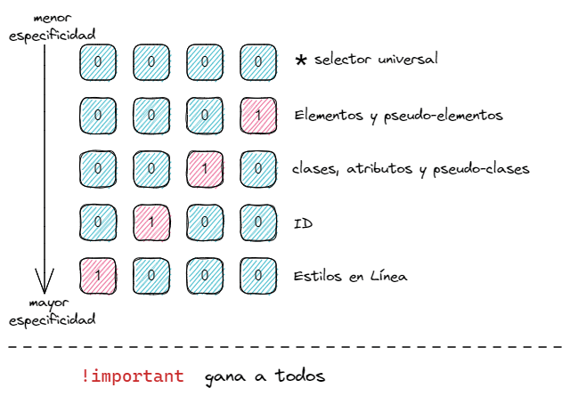

object-fit

# Parcel

[Documentación de Parcel](https://parceljs.org/getting-started/webapp/)

# GRID

[GRID](https://css-tricks.com/snippets/css/complete-guide-grid/)
[GRID_esp](https://lenguajecss.com/css/maquetacion-y-colocacion/grid-css/)

Propiedades para el padre (Grid Container):

display : grid | inline-grid
grid-template-columns: <track-size> <line-name>
grid-template-rows: <track-size> <line-name>
grid-template-areas: "<grid-area-name> | . | none | ..."
                    "<grid-area-name> | . | none | ..."
grid-template: none | <grid-template-rows> / <grid-template-columns>;
  
## grid-template-columns / grid-template-rows
- <track-size> – puede ser una longitud, un porcentaje,o una fracción de espacio vacío en el grid usando la unidad `fr` .
- <line-name> – el nombre que quieras para la fila o columna

``` css
grid-template-columns: 100px 1fr; // Una columna de 100px y otra que ocupa lo que queda de grid.
    
grid-template-columns:[nombrecolumna1] 100px [nombrecolumna2] 50px; // Una columa de 100px que se 
// llama nombrecolumna1 y otra de 50px llamada nombrecoluma2.

// varios nombres
grid-template-columns:[primernombre segundonombre] 100px [nombrecolumna2] 50px; // Una columa de 100px que
// tiene dos nombres y otra de 50px llamada nombrecoluma2.
    
// repeat
grid-template-columns: repeat(3, 200px); //repeat repite columnas, en este caso son 3 columnas de 200px

// fr fracciones
grid-template-columns: 1fr 1fr 1fr; // el grid se divide en tres columnas del mismo tamaño, ocupando todo el grid
```
## grid-template-areas
grid-template-areas: "<grid-area-name> | . | none | ..."
                    "<grid-area-name> | . | none | ..."
                    "..."
    <grid-area-name> – nombre del grid area establecido con grid-area
    . – una celda del grid vacía
    none – ninguna grid area especificada
            
Ejemplo:
    
``` css
.item-a {
  grid-area: header;
}
.item-b {
  grid-area: main;
}
.item-c {
  grid-area: sidebar;
}
.item-d {
  grid-area: footer;
}

.container {
  display: grid;
  grid-template-columns: 50px 50px 50px 50px;
  grid-template-rows: auto;
  grid-template-areas: 
    "header header header header"
    "main main . sidebar"
    "footer footer footer footer";
}
```


## grid-template
Atajo para establecer grid-template-rows, grid-template-columns, y grid-template-areas en una sola declaración.
      
grid-template: none | <grid-template-rows> / <grid-template-columns>;
      
      none – establece las tres propiedades a sus valores iniciales.
      
Ejemplos:

      ```css
      .container {
        grid-template:
          [row1-start] "header header header" 25px [row1-end]
          [row2-start] "footer footer footer" 25px [row2-end]
          / auto 50px auto;
      }
      
      // equivalente a:
      
      .container {
        grid-template-rows: [row1-start] 25px [row1-end row2-start] 25px [row2-end];
        grid-template-columns: auto 50px auto;
        grid-template-areas: 
          "header header header" 
          "footer footer footer";
      }
      ```
      
Ejemplo:

    <div class="contenedor">
      <div class="one">One</div>
      <div class="two">Two</div>
      <div class="three">Three</div>
      <div class="four">Four</div>
      <div class="five">Five</div>
      <div class="six">Six</div>
    </div>
    
    .contenedor {
      display: grid;
      grid-template-columns: repeat(3, 1fr);
      grid-gap: 10px;
      grid-auto-rows: minmax(100px, auto);
    }
    .one {
      grid-column: 1 / 3;
      grid-row: 1;
    }
    .two {
      grid-column: 2 / 4;
      grid-row: 1 / 3;
    }
    .three {
      grid-column: 1;
      grid-row: 2 / 5;
    }
    .four {
      grid-column: 3;
      grid-row: 3;
    }
    .five {
      grid-column: 2;
      grid-row: 4;
    }
    .six {
      grid-column: 3;
      grid-row: 4;
    }


# Metodologías

[Metodologías](https://www.espai.es/blog/2016/07/metodologias-css-oocss-bem-smacss/)

# Breakpoints

[Breakpoints](https://www.alsernet.es/blog/breakpoints-diseno-responsive)

Son las medidas de anchura en donde se realizan saltos para el diseño responsive y se aplican los estilos CSS concretos para unas determinadas media queries. Es decir, los breakpoints son los saltos en los que la pantalla cambia de layout.

# CSS media queries

[CSS media queries](https://developer.mozilla.org/es/docs/Web/CSS/Media_Queries/Using_media_queries)

    @media (min-width: 700px) { ... }
    @media (min-width: 700px) and (max-width: 1000px) { ... }

# Position

## Relative

Elementos posicionados relativamente son desplazados una cantidad dada de su posición normal en el documento, pero sin que su desplazamiento afecte a otros elementos.

hijo{

 position: relative;
 top: 20px;
 botton:
 left:
 right:
 
 ## Absolute
 
Un elemento posicionado absolutamente es removido del flujo de esta manera, los demás elementos se posicionan como si el mismo no existiera. El elemento posicionado absolutamente se posiciona relativamente a su ancestro posicionado más cercano (es decir, el ancestro más cercano que no es static). Si no hay ningún ancestro posicionado se ubica relativo al bloque contenedor inicial. 
 
hijo{

 position: absolute;
 top: 20px;
 botton:
 left:
 right:
 
## Fixed

El posicionamiento fijo es similar al posicionamiento absoluto, con la excepción de que el bloque contenedor del elemento es el viewport. Esto puede usarse para crear un elemento flotante que se mantiene en la misma posición independientemente del desplazamiento.

## Sticky

El posicionamiento sticky puede considerarse un híbrido de los posicionamientos relativo y fijo. Un elemento con 

posicionamiento sticky es tratado como un elemento posicionado relativamente hasta que cruza un umbral especificado, en

cuyo punto se trata como fijo hasta que alcanza el límite de su padre. Por ejemplo...

#one { position: sticky; top: 10px; }


# Flexbox

Maquetación en un plano

[Maquetación con flexbox](https://www.adictosaltrabajo.com/2018/02/14/maquetacion-con-flexbox/)

contenedor {

 ` display: flex;`
 
  `flex-direction:` `row` | `column`; //Eje primario: eje_x(row) | eje_y(column)
  
  //Alineación en el eje primario
  
  `justify-content`: `flex-start` | `flex-end` | `center` | `space-between` | `space-around` | `space-evenly`; 
  
  //Alineación en el eje secundario
  
  `align-items`: `flex-start` | `flex-end` | `center` | `baseline` | `stretch`; 
  
  //Responsividad avanzada
  
  `flex-wrap`: `wrap`;
  
 `flex-wrap` Permite disponer a los hijos en varias lineas si surgiese la casuística de que no consiguiesen caber en una única línea.
  
  width: 100%;
  
  height: 100vh;
  
  padding: 0.5rem;
  
  background-color: blanchedalmond;
  
}

`flex-direction`: estable el eje principal 

`justify-content`: Los elementos hijos son alineados en el eje principal.

hijos{

 `flex` : `none` | [ <'`flex-grow`'> <'`flex-shrink`'>? || <'`flex-basis`'> ]
 `order`:3;
` align-self`: `flex-start` | `flex-end` | `center` | `baseline` | `stretch`; 

}

El valor de flex por defecto es 0 1 auto. Podemos alternar la propiedad flex de cada elemento para modificar su peso:

    flex: 2;..

`flex-grow`: Define la habilidad de un hijo de ocupar espacio sobrante. Recibe un entero. Por defecto es 0.

`flex-shrink`: Define la habilidad de un hijo de encogerse. Recibe un entero. Por defecto es 0.

`flex-basis`: Esta propiedad especifica el tamaño base que ocupa un elemento hasta que éste se puede encoger o ensanchar.

Su valor puede ser una unidad o auto (cuyo valor es el por defecto).

`order` Con order podemos ordenar los elementos.

# Ancla en html
...

# Clases

`class="class1 class2"` Las clases se espacian para separarlas

# Especificidad

Cuanto más elementos tenga el selector, más específico es, y mayor prioridad tiene, sin verse afectado por la lectura en cascada.



# Selectores


`*` Selector universal

e `,` e Selecciona ambos


## Selector de clase

`.classname`  el.classname

## Selector de id

`#idname`

## Selectores de atributo

`[attr]`        Selecciona los elementos que tienen el atributo attr.
  
`[attr=value]`  Selecciona los elementos cuyo atributo attr tenga exactamente el valor value.

`[attr~=value]` Selecciona los elementos cuyo atributo attr tenga por valor una lista de palabras separadas por espacios,    una de las cuales sea value.

`[attr|=value]` Selecciona los elementos cuyo atributo attr tenga exactamente el valor value o empiece por value seguido de un guión -

`[attr^=value]`   Selecciona los elementos cuyo atributo attr tenga un valor prefijado por value.

`[attr$=value]`   Selecciona los elementos cuyo atributo attr cuyo valor tiene el sufijo (seguido) de value.

`[attr*=value]`   Selecciona los elementos cuyo atributo attr tenga un valor que contenga value.

## Combinadores

**Combinadores descendientes**

`A B`     El combinador (espacio) selecciona los elementos que son descendientes del primer elemento.

**Combinador de hijo**

`A > B`   El combinador > selecciona los elementos que son hijos directos del primer elemento.

**Combinador de hermanos adyacentes**

`A + B`   El combinador + selecciona hermanos adyacentes. Esto quiere decir que el segundo elemento sigue directamente al primero y ambos comparten el mismo elemento padre.

**Combinador general de hermanos**

`A ~ B`   El combinador ~ selecciona hermanos. Esto quiere decir que el segundo elemento sigue al primero (no necesariamente de forma inmediata) y ambos comparten el mismo elemento padre.

## Pseudoclases


Palabra clave que se añade a los selectores y que especifica un estado especial del elemento seleccionado.

`selector:pseudoclase { propiedad: valor; }`


## Pseudoelementos


Permiten añadir estilos a una parte concreta del documento.

`selector::pseudo-elemento { propiedad: valor; }`

## Diferencia entre > y :first-child

# Propiedades

`display` : `block` | `inline`| `inline-block` | `flex` | `grid`

## Keywords

propiedad: 

-`none` -> borrar un propiedad

-`inherit` -> valor de la propiedad heredada del elemento padre

-`initial` -> restablece el valor

-`unset` -> restablece el valor al valor heredado o a su valor inicial

## Medidas

### Absolutas:

`px` No cambia sin importar el tamaño del proyecto.

### Relativas

`em` hace referencia al tamaño actual de la fuente que ha sido establecido en el navegador.

`rem` representa el tamaño (font-size) del elemento raiz ...

### Flexibles

`vw`: se calcula con respecto al ancho del viewport.
  100vw = 100% de la ventana

`vh`: se calcula con respecto a la altura del viewport.

`vmin/vmax`

`%`: respecto al padre

## Box model


\* {

  `box-sizing: border-box;`
  
}

Redefine de qué manera ha de calcular la altura y la anchura de los elementos de nuestra página. Es prácticamente

obligatorio definir esta propiedad si queremos que nuestra maquetación sea predecible.

`border-box` provoca que los paddings y bordes se apliquen en el interior de la caja.
